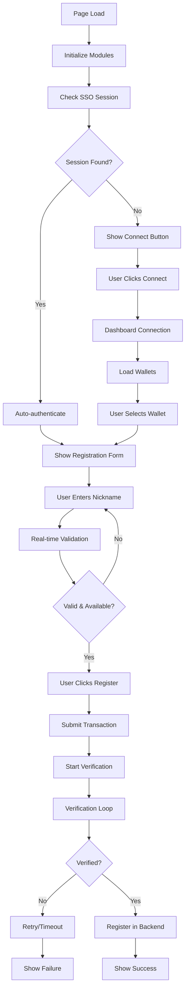

# CPUNK.IO JavaScript Documentation

**DNA Registration System - Complete Technical Reference**

*Generated: 2025-08-06*  
*Version: 1.0*  
*Domain: cpunk.io (Identity Platform)*

---

## Table of Contents

1. [Overview](#overview)
2. [Architecture](#architecture)
3. [Core Modules](#core-modules)
4. [API Integration](#api-integration)
5. [User Flow](#user-flow)
6. [Configuration](#configuration)
7. [Error Handling](#error-handling)
8. [Debugging](#debugging)
9. [Deployment](#deployment)
10. [Maintenance](#maintenance)

---

## Overview

The CPUNK.IO JavaScript system provides a complete DNA (Distributed Name & Addressing) registration platform for the identity-focused domain of the CPUNK ecosystem. This system enables users to register human-readable nicknames tied to their Cellframe wallet addresses through a seamless, secure, and user-friendly interface.

### Key Features

- **Cross-Domain SSO**: Seamless authentication with cpunk.club
- **Real-time Validation**: 500ms debounced nickname availability checking
- **Multi-language Support**: 8 languages with dynamic switching
- **Transaction Verification**: Automated blockchain transaction confirmation
- **Progressive UI**: 5-step registration process with visual feedback
- **Debug Console**: Comprehensive API logging and error tracking
- **Mobile Responsive**: Touch-optimized interface for all devices

### Technical Stack

- **Frontend**: Vanilla JavaScript (ES6+), HTML5, CSS3
- **Backend Integration**: Cellframe Dashboard API, DNA Proxy API
- **Authentication**: Session-based with cross-domain support
- **Storage**: sessionStorage for state persistence
- **Networking**: Fetch API for HTTP requests

---

## Architecture

### Module Dependency Graph

```
register.js (Main Controller)
├── cpunk-utils.js (Core Utilities)
├── cpunk-transaction.js (Transaction Management)
├── cpunk-ui.js (User Interface)
├── dashboardConnector.js (Cellframe Integration)
├── cpunk-api-console.js (Debug Console)
├── translation.js (Internationalization)
└── navbar.js (Navigation)
```

### Data Flow

```
User Input → Validation → Transaction → Verification → Registration
     ↓            ↓           ↓           ↓            ↓
  register.js  cpunk-utils  cpunk-tx   cpunk-utils  cpunk-utils
     ↓            ↓           ↓           ↓            ↓
  Form UI    Availability  Dashboard  DNA Proxy   Success UI
```

### Cross-Domain Architecture

```
cpunk.io (Identity) ←→ cpunk.club (Community)
        ↓                      ↓
   DNA Registration      Profile Display
        ↓                      ↓
   Shared Backend APIs   Shared User Data
```

---

## Core Modules

### 1. cpunk-utils.js

**Purpose**: Central utility library for API communication, validation, and helper functions.

#### Key Functions

##### `init(customConfig)`
Initializes the utility library with configuration options.

```javascript
CpunkUtils.init({
    debug: {
        enabled: true,
        showInConsole: true,
        showInUI: true,
        showOnlyOnError: false
    }
});
```

##### `dashboardRequest(method, params, options)`
Makes requests to the Cellframe Dashboard API.

```javascript
const response = await CpunkUtils.dashboardRequest('StartSession');
// Returns: { status: 'ok', data: { id: 'session_id' } }
```

##### `dnaLookup(action, value)`
Performs DNA-related API queries.

```javascript
const result = await CpunkUtils.dnaLookup('lookup', 'nickname');
// Returns availability or registration data
```

##### `isValidNicknameFormat(nickname)`
Validates DNA nickname format.

- Length: 3-36 characters
- Characters: a-z, A-Z, 0-9, _, -, .

```javascript
const isValid = CpunkUtils.isValidNicknameFormat('my_nickname');
// Returns: true/false
```

##### `calculateDnaPrice(nickname)`
Returns pricing based on nickname length.

- 3 characters: 500 CPUNK
- 4 characters: 100 CPUNK
- 5+ characters: 5 CPUNK

```javascript
const price = CpunkUtils.calculateDnaPrice('abc');
// Returns: 500
```

##### `checkNicknameAvailability(nickname)`
Comprehensive availability checking with ownership detection.

```javascript
const result = await CpunkUtils.checkNicknameAvailability('nickname');
// Returns: { isAvailable: boolean, isAlreadyOwned: boolean, response: Object }
```

##### `startTransactionVerification(txHash, onVerify, onFail, onAttempt, network)`
Initiates automated transaction verification with retry schedule.

**Verification Schedule:**
- Attempt 1: 15 seconds
- Attempt 2: 60 seconds (45s later)
- Attempts 3-10: Every 60 seconds

```javascript
const timers = CpunkUtils.startTransactionVerification(
    txHash,
    (hash, attempt) => console.log('Verified!'),
    (hash, attempts) => console.log('Failed'),
    (attempt, max) => console.log(`Attempt ${attempt}/${max}`)
);
```

##### `registerDna(params)`
Submits DNA registration to backend.

```javascript
const result = await CpunkUtils.registerDna({
    nickname: 'mynick',
    walletAddress: 'Rj7J7...',
    txHash: '0x123...'
});
```

#### Debug Functions

##### `logDebug(message, type, data)`
Comprehensive logging system with multiple output channels.

Types: `info`, `request`, `response`, `error`, `warning`

```javascript
CpunkUtils.logDebug('Operation started', 'info', { userId: 123 });
```

##### `getDebugEntries(limit)`
Retrieves recent debug entries for analysis.

```javascript
const entries = CpunkUtils.getDebugEntries(10);
// Returns last 10 debug entries
```

### 2. cpunk-transaction.js

**Purpose**: Manages blockchain transactions, verification, and coordination.

#### Configuration

```javascript
const DEFAULT_CONFIG = {
    dashboardApiUrl: 'http://localhost:8045/',
    dnaProxyUrl: 'dna-proxy.php',
    maxVerificationAttempts: 10,
    verificationSchedule: [15, 45, 60, 60, 60, 60, 60, 60, 60, 60]
};
```

#### Key Functions

##### `sendTransaction(params)`
Submits transactions to Cellframe Dashboard.

```javascript
const result = await CpunkTransaction.sendTransaction({
    sessionId: 'session_id',
    walletName: 'MyWallet',
    network: 'Backbone',
    toAddress: 'Rj7J7...',
    tokenName: 'CPUNK',
    value: '5.0e+18'
});
// Returns: { success: true, txHash: '0x123...', raw: {...} }
```

##### `startVerification(params)`
Coordinates transaction verification with callbacks.

```javascript
CpunkTransaction.startVerification({
    txHash: '0x123...',
    network: 'Backbone',
    onVerificationStart: (hash) => console.log('Started'),
    onVerificationSuccess: (hash, attempt) => console.log('Success'),
    onVerificationFail: (hash, attempts) => console.log('Failed'),
    onVerificationAttempt: (attempt, max) => console.log(`${attempt}/${max}`)
});
```

##### `createStakingOrder(params)`
Creates staking orders for delegation.

```javascript
const result = await CpunkTransaction.createStakingOrder({
    sessionId: 'session_id',
    walletName: 'MyWallet',
    network: 'Backbone',
    value: '100.0e+18',
    tax: '70.0'
});
```

### 3. cpunk-ui.js

**Purpose**: User interface components, visual feedback, and interaction handling.

#### Key Functions

##### `createWalletCard(wallet, onSelect)`
Generates wallet selection cards with balance display.

```javascript
const card = CpunkUI.createWalletCard({
    name: 'MyWallet',
    network: 'Backbone',
    address: 'Rj7J7...',
    tokens: [
        { tokenName: 'CPUNK', balance: 1000 },
        { tokenName: 'CELL', balance: 10 }
    ]
}, (wallet) => console.log('Selected:', wallet));
```

##### `createVerificationUI(txHash, orderHash)`
Creates comprehensive transaction verification interface.

```javascript
const ui = CpunkUI.createVerificationUI('0x123...', '0xabc...');
document.getElementById('container').appendChild(ui);
```

##### `updateVerificationUI(status, params)`
Updates verification interface based on transaction status.

**Status Types:**
- `pending`: Initial state
- `progress`: Verification attempts in progress
- `success`: Transaction verified
- `failed`: Verification timed out
- `error`: Verification error

```javascript
CpunkUI.updateVerificationUI('progress', {
    attempt: 3,
    maxAttempts: 10
});
```

##### `showError(message, elementId, timeout)`
Displays error messages with automatic timeout.

```javascript
CpunkUI.showError('Connection failed', 'errorDiv', 5000);
```

##### `copyHash(hash, buttonElement)`
Provides clipboard functionality for transaction hashes.

```javascript
// Used in HTML: onclick="CpunkUI.copyHash('0x123...', this)"
```

### 4. dashboardConnector.js

**Purpose**: Cellframe Dashboard API integration and session management.

#### Configuration

```javascript
const DEFAULT_CONFIG = {
    apiUrl: 'http://localhost:8045/',
    dnaProxyUrl: 'dna-proxy.php',
    onConnected: null,
    onWalletSelected: null,
    onDnaSelected: null,
    onError: null
};
```

#### Session Management

**Storage Keys:**
- `cpunk_dashboard_session`: Dashboard session ID
- `cpunk_selected_wallet`: Selected wallet name
- `cpunk_selected_network`: Selected network
- `cpunk_selected_dna`: Selected DNA nickname
- `cpunk_wallet_data`: Cached wallet information

#### Key Functions

##### `init(customConfig)`
Initializes dashboard connector with custom callbacks.

```javascript
CpunkDashboard.init({
    onConnected: (sessionId) => console.log('Connected'),
    onWalletSelected: (wallet) => console.log('Wallet selected'),
    onError: (error) => console.error('Error:', error)
});
```

##### `connect()`
Establishes connection to Cellframe Dashboard.

```javascript
await CpunkDashboard.connect();
// Triggers onConnected callback on success
```

##### `loadWallets()`
Retrieves and displays available wallets.

```javascript
await CpunkDashboard.loadWallets();
// Populates wallet selection interface
```

##### `getWalletData(walletName)`
Fetches detailed wallet information including token balances.

```javascript
const data = await CpunkDashboard.getWalletData('MyWallet');
// Returns detailed wallet data with network information
```

### 5. cpunk-api-console.js

**Purpose**: Interactive debugging console for API monitoring and troubleshooting.

#### Features

- **Real-time API Logging**: Captures all HTTP requests/responses
- **Request-Response Pairing**: Links related API calls
- **Visual Console Interface**: Resizable, draggable debug window
- **Activity Indicator**: Shows API activity when console is minimized
- **Copy Support Information**: One-click debug data export

#### Usage

```javascript
// Initialize console
CpunkAPIConsole.init();

// Manual logging
CpunkAPIConsole.log('Custom message', 'info', { data: 'value' });

// Show/hide console
CpunkAPIConsole.show();
CpunkAPIConsole.hide();

// Keyboard shortcut: Ctrl+Shift+D
```

#### Log Types

- `request`: Outgoing API requests
- `response`: API responses
- `error`: Error conditions
- `warning`: Warning messages
- `info`: General information

### 6. register.js

**Purpose**: Main controller orchestrating the complete DNA registration workflow.

#### State Management

```javascript
// Global state variables
let sessionId = null;           // Dashboard session
let walletAddress = null;       // Selected wallet address
let currentDna = null;          // Current DNA nickname
let currentBalances = {         // Token balances
    cpunk: 0,
    cell: 0
};
let dnaChecked = false;         // Validation status
let verificationTimers = [];    // Active verification timers
let currentTxHash = null;       // Transaction hash
let currentDnaName = null;      // DNA being registered
```

#### 5-Step Registration Process

##### Step 1: Authentication
- Automatic SSO detection from cpunk.club
- Dashboard session restoration
- Connection status display

##### Step 2: Wallet Selection
- Wallet balance loading (skipped in SSO mode)
- Balance validation for registration
- Network compatibility checking

##### Step 3: DNA Input & Validation
- Real-time format validation
- 500ms debounced availability checking
- Price calculation and display
- Balance sufficiency verification

##### Step 4: Transaction Submission
- Payment transaction to treasury
- Transaction hash extraction
- Progress indicator activation

##### Step 5: Verification & Registration
- Automated verification loop
- Backend DNA registration
- Success/failure handling

#### Key Functions

##### `validateDnaInput()`
Comprehensive nickname validation with real-time feedback.

```javascript
async function validateDnaInput() {
    const nickname = dnaInput.value.trim();
    
    // Format validation
    if (!CpunkUtils.isValidNicknameFormat(nickname)) {
        // Show format error
        return false;
    }
    
    // Price calculation
    const price = CpunkUtils.calculateDnaPrice(nickname);
    
    // Balance check
    if (currentBalances.cpunk < price) {
        // Show insufficient balance
        return false;
    }
    
    // Availability check
    const result = await CpunkUtils.checkNicknameAvailability(nickname);
    if (!result.isAvailable && !result.isAlreadyOwned) {
        // Show unavailable
        return false;
    }
    
    // Enable registration
    registerButton.disabled = false;
    return true;
}
```

##### `registerDNA()`
Main registration function coordinating the entire process.

```javascript
async function registerDNA() {
    // Validation
    if (!sessionId || !walletAddress) return;
    
    // Transaction submission
    const txResult = await CpunkTransaction.sendTransaction({
        sessionId: sessionId,
        walletName: walletName,
        network: 'Backbone',
        toAddress: TARGET_ADDRESS,
        tokenName: 'CPUNK',
        value: paymentAmount
    });
    
    // Verification coordination
    CpunkTransaction.startVerification({
        txHash: txResult.txHash,
        onVerificationSuccess: completeDnaRegistration,
        onVerificationFail: showRegistrationFailed
    });
}
```

##### `completeDnaRegistration(nickname, walletAddress, txHash)`
Finalizes DNA registration after transaction verification.

```javascript
async function completeDnaRegistration(nickname, walletAddress, txHash) {
    const result = await CpunkUtils.registerDna({
        nickname: nickname,
        walletAddress: walletAddress,
        txHash: txHash
    });
    
    if (result.success) {
        // Show success message
        // Provide profile link to cpunk.club
    } else {
        // Show error with support information
    }
}
```

### 7. translation.js

**Purpose**: Multi-language support with dynamic page translation.

#### Supported Languages

- **en**: English (default/fallback)
- **es**: Spanish
- **it**: Italian  
- **ru**: Russian
- **tr**: Turkish
- **ar**: Arabic
- **fr**: French
- **zh**: Chinese

#### Usage

```javascript
// Global translation function
const text = t('register.nicknameLabel');

// With parameters
const message = t('register.insufficientBalance', { price: 5 });

// Direct instance methods
window.i18n.setLanguage('es');
const current = window.i18n.getCurrentLanguage();
```

#### HTML Integration

```html
<!-- Text content -->
<h1 data-i18n="register.title">Register DNA</h1>

<!-- HTML content -->
<div data-i18n-html="register.instructions">Registration steps...</div>

<!-- Attributes -->
<input data-i18n-title="register.nicknameTooltip" type="text">

```

### 8. navbar.js

**Purpose**: Navigation functionality and mobile menu management.

#### Features

- **Template Loading**: Dynamic navbar HTML injection
- **Mobile Menu**: Touch-optimized navigation
- **Language Switcher**: Integrated language selection
- **Active Page Detection**: Automatic highlighting
- **Responsive Design**: Adaptive layout for all screen sizes

#### Key Functions

```javascript
// Automatically loads navbar template
// Sets up mobile menu functionality
// Configures language switcher
// Handles dropdown interactions
```

---

## API Integration

### Cellframe Dashboard API

**Base URL**: `http://localhost:8045/`

#### Authentication
```javascript
const response = await CpunkUtils.dashboardRequest('StartSession');
// Response: { status: 'ok', data: { id: 'session_id' } }
```

#### Wallet Operations
```javascript
// Get wallets
const wallets = await CpunkUtils.dashboardRequest('GetWallets', { id: sessionId });

// Get wallet data
const data = await CpunkUtils.dashboardRequest('GetDataWallet', { 
    id: sessionId, 
    walletName: 'MyWallet' 
});

// Send transaction
const tx = await CpunkUtils.dashboardRequest('SendTransaction', {
    id: sessionId,
    net: 'Backbone',
    walletName: 'MyWallet',
    toAddr: 'Rj7J7...',
    tokenName: 'CPUNK',
    value: '5.0e+18'
});
```

### DNA Proxy API

**Base URL**: `dna-proxy.php`

#### Lookup Operations
```javascript
// Check availability
const result = await CpunkUtils.dnaLookup('lookup', 'nickname');

// Validate transaction
const validation = await fetch(`dna-proxy.php?tx_validate=${hash}&network=backbone`);
```

#### Registration Operations
```javascript
// Register DNA
const result = await CpunkUtils.dnaPost({
    action: 'add',
    name: 'nickname',
    wallet: 'Rj7J7...',
    tx_hash: '0x123...'
});
```

### Response Formats

#### Success Response
```json
{
    "status_code": 0,
    "message": "OK",
    "response_data": {
        "registered_names": {
            "nickname": {
                "creation_date": "2025-08-06",
                "expiry_date": "2026-08-06"
            }
        }
    }
}
```

#### Error Response
```json
{
    "status_code": -1,
    "message": "Error",
    "description": "Nickname already taken"
}
```

---

## User Flow

### Complete Registration Journey



### State Transitions

```javascript
// Page states
const STATES = {
    LOADING: 'loading',           // Initial load
    CONNECTING: 'connecting',     // Dashboard connection
    CONNECTED: 'connected',       // Ready for input
    VALIDATING: 'validating',     // Nickname check
    VALID: 'valid',              // Ready to register
    SUBMITTING: 'submitting',     // Transaction submit
    VERIFYING: 'verifying',       // Transaction verify
    REGISTERING: 'registering',   // Backend register
    SUCCESS: 'success',           // Registration complete
    FAILED: 'failed'             // Registration failed
};
```

---

## Configuration

### Environment Variables

```javascript
// Target treasury address for payments
const TARGET_ADDRESS = 'Rj7J7MiX2bWy8sNyZcoLqkZuNznvU4KbK6RHgqrGj9iqwKPhoVKE1xNrEMmgtVsnyTZtFhftMPAJbaswuSLp7UeBS7jiRmE5uvuUJaKA';

// API endpoints
const API_CONFIG = {
    dashboardApiUrl: 'http://localhost:8045/',
    dnaProxyUrl: 'dna-proxy.php'
};

// Debug configuration
const DEBUG_CONFIG = {
    enabled: true,
    showInConsole: true,
    showInUI: true,
    showOnlyOnError: false
};
```

### Pricing Configuration

```javascript
// DNA pricing by character length
const PRICING_TIERS = {
    3: 500,    // 3 chars = 500 CPUNK
    4: 100,    // 4 chars = 100 CPUNK
    5: 5       // 5+ chars = 5 CPUNK
};
```

### Verification Configuration

```javascript
// Transaction verification schedule (seconds)
const VERIFICATION_SCHEDULE = [
    15,   // First attempt: 15s
    45,   // Second attempt: 60s total (45s later)
    60,   // Third attempt: 120s total
    60,   // Fourth attempt: 180s total
    60,   // Fifth attempt: 240s total
    60,   // Sixth attempt: 300s total
    60,   // Seventh attempt: 360s total
    60,   // Eighth attempt: 420s total
    60,   // Ninth attempt: 480s total
    60    // Tenth attempt: 540s total (9 minutes)
];
```

---

## Error Handling

### Error Categories

#### 1. Network Errors
- Dashboard API unavailable
- DNA Proxy API timeout
- Network connectivity issues

```javascript
// Handling network errors
try {
    const response = await CpunkUtils.dashboardRequest('GetWallets');
} catch (error) {
    if (error.message.includes('Failed to fetch')) {
        CpunkUI.showError('Network connection failed. Please check your internet connection.');
    }
}
```

#### 2. Authentication Errors
- Session expired
- Invalid session ID
- Dashboard disconnection

```javascript
// Session validation
if (!sessionId) {
    CpunkUI.showError('Please connect your wallet first.');
    return;
}
```

#### 3. Validation Errors
- Invalid nickname format
- Nickname already taken
- Insufficient balance

```javascript
// Nickname validation
if (!CpunkUtils.isValidNicknameFormat(nickname)) {
    let errorMessage = "Invalid nickname format. ";
    if (nickname.length < 3) {
        errorMessage += "Minimum 3 characters required.";
    } else if (nickname.length > 36) {
        errorMessage += "Must be 36 characters or less.";
    } else {
        errorMessage += "Only letters, numbers, underscore (_), hyphen (-), and period (.) allowed.";
    }
    dnaValidationStatus.textContent = errorMessage;
    dnaValidationStatus.className = 'validation-message validation-error';
    return false;
}
```

#### 4. Transaction Errors
- Transaction submission failure
- Verification timeout
- Invalid transaction hash

```javascript
// Transaction error handling
CpunkTransaction.startVerification({
    txHash: txHash,
    onVerificationFail: (hash, attempts, error) => {
        CpunkUI.showError(`Transaction verification failed after ${attempts} attempts.`);
        showRegistrationFailed(hash, nickname, walletAddress);
    }
});
```

#### 5. Registration Errors
- Backend API failure
- Duplicate registration
- Invalid registration data

```javascript
// Registration error handling
try {
    const result = await CpunkUtils.registerDna({
        nickname: nickname,
        walletAddress: walletAddress,
        txHash: txHash
    });
    
    if (!result.success) {
        throw new Error(result.message || 'Registration failed');
    }
} catch (error) {
    CpunkUtils.logDebug('Error completing DNA registration', 'error', {
        nickname: nickname,
        error: error.message,
        stack: error.stack
    });
    
    showDebugPanel();
    
    registrationResult.innerHTML = `
        <h3>Registration Failed</h3>
        <p>Error: ${error.message}</p>
        <p>Transaction hash: <code>${txHash}</code></p>
        <p>Please contact support with your transaction hash.</p>
    `;
}
```

### Error Recovery

#### Retry Mechanisms
- Automatic retry for network failures
- Manual retry buttons for user-initiated recovery
- Exponential backoff for API requests

#### User Feedback
- Clear error messages with actionable steps
- Debug information for support tickets
- Progress indicators during recovery attempts

#### Graceful Degradation
- Fallback functionality when services are unavailable
- Cached data usage when possible
- Alternative flows for critical operations

---

## Debugging

### Debug Console Features

#### Real-time API Monitoring
- All HTTP requests/responses logged
- Request-response pairing
- Performance timing information
- Error tracking and categorization

#### Interactive Console Interface
- Resizable and draggable debug window
- Activity indicator when minimized
- Log filtering by type and time
- Copy functionality for support tickets

#### Debug Levels
- **Info**: General operation information
- **Request**: Outgoing API calls with parameters
- **Response**: API responses with timing
- **Warning**: Non-critical issues
- **Error**: Error conditions with stack traces

### Debugging Tools

#### CpunkAPIConsole
```javascript
// Show console
CpunkAPIConsole.show();

// Manual logging
CpunkAPIConsole.log('Custom debug message', 'info', { data: 'value' });

// Clear logs
CpunkAPIConsole.clear();
```

#### Debug Utility Functions
```javascript
// Get recent debug entries
const entries = CpunkUtils.getDebugEntries(10);

// Format JSON for HTML display
const formatted = CpunkUtils.formatJsonForHtml(data);

// Copy debug info to clipboard
CpunkUtils.copyToClipboard(debugText, onSuccess, onError);
```

#### Browser Developer Tools Integration
```javascript
// Console logging with grouping
console.group('🔷 API Request: GetWallets');
console.log('Timestamp:', timestamp);
console.log('Parameters:', params);
console.groupEnd();
```

### Common Debugging Scenarios

#### Transaction Verification Issues
1. Check transaction hash format
2. Verify network parameter (Backbone)
3. Confirm treasury address
4. Review verification timing

#### Authentication Problems
1. Verify session ID persistence
2. Check cross-domain session sharing
3. Confirm dashboard API connectivity
4. Review SSO integration

#### Validation Failures
1. Test nickname format validation
2. Check availability API responses
3. Verify pricing calculations
4. Review balance checking logic

---

## Deployment

### File Structure
```
cpunk.io/js/
├── cpunk-utils.js           # Core utilities (834 lines)
├── cpunk-transaction.js     # Transaction management (287 lines)
├── cpunk-ui.js             # UI components (394 lines)
├── dashboardConnector.js   # Dashboard integration (822 lines)
├── cpunk-api-console.js    # Debug console
├── register.js             # Main controller (1148 lines)
├── navbar.js               # Navigation
└── translation.js          # Internationalization
```

### Build Process
1. **Minification**: Compress JavaScript files for production
2. **Bundling**: Combine related modules if desired
3. **Asset Optimization**: Optimize images and fonts
4. **Cache Headers**: Configure appropriate caching

### Environment Configuration

#### Development
```javascript
const CONFIG = {
    debug: true,
    apiTimeout: 30000,
    retryAttempts: 3,
    logLevel: 'debug'
};
```

#### Production
```javascript
const CONFIG = {
    debug: false,
    apiTimeout: 10000,
    retryAttempts: 5,
    logLevel: 'error'
};
```

### Performance Optimization

#### JavaScript Loading
- Defer non-critical scripts
- Async loading where appropriate
- Critical path optimization
- Code splitting for large modules

#### API Optimization
- Request caching for repeated calls
- Connection pooling for dashboard API
- Retry logic with exponential backoff
- Timeout configuration

#### UI Optimization
- Debounced input validation (500ms)
- Efficient DOM manipulation
- Event delegation for dynamic content
- Progressive enhancement

---

## Maintenance

### Regular Tasks

#### Code Review
- Security audit of API communications
- Performance analysis and optimization
- Code quality assessment
- Documentation updates

#### Testing
- Cross-browser compatibility testing
- Mobile device testing
- API integration testing
- Error scenario testing

#### Monitoring
- API response time monitoring
- Error rate tracking
- User experience metrics
- Performance benchmarking

### Version Management

#### Semantic Versioning
- Major: Breaking changes
- Minor: New features
- Patch: Bug fixes

#### Release Process
1. Code review and testing
2. Documentation updates
3. Version tagging
4. Deployment to staging
5. Production deployment
6. Post-deployment monitoring

### Troubleshooting Guide

#### Common Issues

**Registration Fails After Payment**
1. Check transaction verification logs
2. Verify backend API connectivity
3. Review transaction hash format
4. Confirm network parameters

**Session Authentication Problems**
1. Clear browser cache and cookies
2. Check cross-domain session settings
3. Verify dashboard API connection
4. Review SSO integration

**Nickname Validation Issues**
1. Test format validation rules
2. Check availability API responses
3. Verify pricing calculations
4. Review balance checking

**Mobile Interface Problems**
1. Test on actual devices
2. Check touch event handling
3. Verify responsive design
4. Review mobile menu functionality

### Support Information

#### Debug Data Collection
```javascript
// Generate support ticket information
function generateSupportInfo() {
    const debugEntries = CpunkUtils.getDebugEntries(20);
    const browserInfo = {
        userAgent: navigator.userAgent,
        language: navigator.language,
        platform: navigator.platform,
        cookieEnabled: navigator.cookieEnabled
    };
    
    return {
        timestamp: new Date().toISOString(),
        debugEntries: debugEntries,
        browserInfo: browserInfo,
        sessionData: {
            sessionId: sessionId,
            walletAddress: walletAddress,
            currentDna: currentDna
        }
    };
}
```

#### Contact Information
- **Technical Issues**: Submit debug console output
- **Registration Problems**: Include transaction hash
- **Feature Requests**: Describe use case and requirements
- **Bug Reports**: Provide steps to reproduce

---

## Conclusion

The CPUNK.IO JavaScript system provides a robust, scalable, and user-friendly platform for DNA registration on the identity-focused domain. With comprehensive error handling, real-time validation, cross-domain integration, and extensive debugging capabilities, it delivers a professional-grade user experience while maintaining code quality and maintainability.

This documentation serves as a complete technical reference for developers working with the system, covering everything from basic usage to advanced debugging and maintenance procedures.

---

*Documentation Version: 1.0*  
*Last Updated: 2025-08-06*  
*Total JavaScript Code: ~4,200 lines*  
*Modules: 8 core files*  
*Languages Supported: 8*